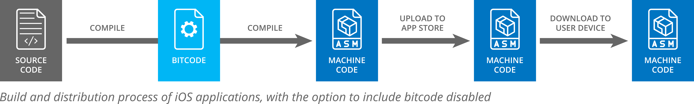
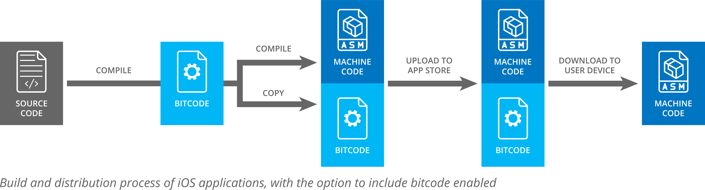

# Existing work

Here's the Makefile credited in SwiftyTesseract: <https://github.com/gali8/Tesseract-OCR-iOS/blob/master/TesseractOCR/Makefile>

It seems crazy to write it as a Makefile, but whatever. Try cribbing this for what we need.

## Understanding multi-arch binaries, and supported iOS architectures

From, [Actually it's not THAT uncommon for fat binaries to contain multiple architectur... | Hacker News][1]:
> Actually it's not THAT uncommon for fat binaries to contain multiple architectures. True, on today's macOS (and especially in the fall when 32bit support will be deprecated in 10.14), it looks like x86_64 rules supreme, but for a long while it was common to have combined i386 and x86_64 fat binaries, and before that, combined ppc and i386 binaries. Finally, it's not far-fetched to believe that in the medium near future, we'll need fat binaries with x86_64 and aarch64.
>
> Edit: actually, even in today's mostly-x86_64-only world, there are fat binaries in macOS, because there is a separate "x86_64h" architecture for "haswell and better". So even in a pure 64bit intel world, there's going to be fat binaries for a while. For example, "file /usr/lib/libobjc.dylib" shows three slices on macOS 10.13:
>
>| Library | Description |
|-------------------------------------------|-------------------------------------------------------------------------------------------------------------------------|
| libobjc.dylib: | Mach-O universal binary with 3 architectures: [x86_64:Mach-O 64-bit dynamically linked shared library x86_64] [x86_64h] |
| libobjc.dylib (for architecture x86_64): | Mach-O 64-bit dynamically linked shared library x86_64 |
| libobjc.dylib (for architecture i386): | Mach-O dynamically linked shared library i386 |
| libobjc.dylib (for architecture x86_64h): | Mach-O 64-bit dynamically linked shared library x86_64h |
>
> On iOS, having a non-fat binary is almost the exception to the rule. For the longest time, it was common to have both armv6 and armv7 slices, and these days, armv7 and aarch64 slices. Granted, with iOS11 dropping armv[6|7] and apps starting to drop iOS10 support, we'll have a run with non-fat aarch64 binaries for a while. This is quite visible for compile times and compile errors during development! Also, for iOS, there's bitcode and app thinning which does mean end user devices are often served a single slice non-fat binary anyways.
>
> Vendors of closed source iOS libraries, such as the "Google maps for iOS" SDK, often ship fat binaries for the .dylibs containing both armv7, aarch64, i386 and/or x86_64. Why are Intel slices for iOS a thing? To be able to run your app and the library in the Xcode iOS simulator, which actually runs x86 code only. That's why it's not called an "emulator".
>
> The history of fat binaries in macOS goes all the way back to NeXTSTEP (of course, since macOS is basically a modern NeXTSTEP, with NSObject still showing off the legacy behind the curtain to new iOS developers) where even m68k was a common slice. [NeXTSTEP, Multi-Architecture ("Fat") Binaries][2] which at times even exploded to "Quad-fat binaries" containing slices for m68k, i386, pa-risc and sparc all together in one executable.

From, [Arm architecture | Wikipedia][5]:
> iOS supports ARMv8-A in iOS 7 and later on 64-bit Apple SoCs. iOS 11 and later only supports 64-bit ARM processors and applications.
>
> ARMv8-A (often called ARMv8[...]) represents a fundamental change to the ARM architecture. It adds an optional 64-bit architecture [...], named "AArch64", and the associated new "A64" instruction set. AArch64 provides user-space compatibility with ARMv7-A, the 32-bit architecture, therein referred to as "AArch32" and the old 32-bit instruction set, now named "A32"

## Build tools for macOS

### Xcode 11

> * is available in the Mac App Store and includes SDKs for iOS 13, macOS Catalina 10.15...
> * supports development for devices running iOS 13.1.
> * supports on-device debugging for iOS 8 and later...
> * requires a Mac running macOS Mojave 10.14.4 or later.

### Problems you might run into with Pre-requisites

* [Can't compile a C program on a Mac after upgrading to Catalina 10.15][3]
* [Can't compile C program on a Mac after upgrade to Mojave][4]

## Bitcode

* <https://stackoverflow.com/questions/32868297/compiling-ios-library-with-bitcode-enabled>
* <https://www.infoq.com/articles/ios-9-bitcode/>
  > This unlocked the potential for a complete LLVM based tool chain to compile iOS applications. LLVM provides a virtual instruction set that can be translated to (and optimised for) a specific processor architecture. The generic instruction set also has several representation forms: it can be stored in a textual based assembler format called IR (like assembly) or translated to a binary format (like an object file). It is this binary format that is called bitcode.
  >
  > However, bitcode is not completely architecture or calling convention independent. The size of registers is a fairly important property in an instruction set; more data can be stored in a 64-bit register than a 32-bit register. Generated bit code for a 64-bit platform will therefore look different than bit code generated for a 32-bit platform.

  But this doesn't apply to us

### Guardsquare: "Is it safe to enable bitcode?"

*Taken from <https://www.guardsquare.com/en/blog/enable-bitcode>*

10 January 2018

Since 2015, Apple gives you the possibility to include bitcode in your iOS application or SDK. To dissipate the confusion surrounding bitcode, we have gathered the essential information in this blog. We cover the following topics: What is bitcode? What are bitcode-enabled builds? What does Apple do with the embedded bitcode? Are there security implications to embedding bitcode?

#### What is bitcode

To understand what bitcode is, we need to take a step back and look at the process of compiling. A compiler is a program that processes human-readable source code and converts it into machine code, that is code a computer or mobile device can read and execute.

The process of compiling consists of three different steps:

1. The compiler front-end converts the source code into some kind of intermediate representation (IR).
2. The optimizer performs a sequence of optimizing transformations on the IR to render it smaller and more performant: redundant code is removed, results are precalculated, code is inlined, etc. This crucial step of the compilation process makes use of IR, rather than source code or machine code, because it can more easily be interpreted by the optimizer.
3. The compiler back-end generates machine code based on the optimized IR.

When we are talking about bitcode, we are actually talking about the IR used by the Clang compiler (or more accurately, about the representation on disk of this compiler’s IR). Clang is a widely used C/C++/Objective-C language family compiler that makes use of the LLVM framework. It is also the compiler that Apple uses in Xcode to compile iOS and macOS applications. You could say that bitcode is nothing new as it has always existed in the LLVM compiler framework.

### Bitcode-enabled builds

At the same time, it is clear that something has changed. In 2015, Apple added the option to embed bitcode into applications compiled with Xcode. When this option is disabled, the compiler generates an executable file that only contains machine code.

But when it is enabled, the bitcode is included in the executable file alongside the generated machine code.

When executing an application that contains embedded bitcode, this bitcode is ignored and the application runs the machine code in exactly the same way as it would run an ordinary executable.

### What does Apple do with the embedded bitcode

The question remains: why does Apple offer the option to embed bitcode? The answer is straightforward. With the bitcode embedded in the executable, Apple is able to recompile applications without interacting with the developer. This has a lot of advantages.

Apple is continuously enhancing the optimization performed by the Clang compiler to further improve the performance of mobile applications and reduce their size. Using the embedded bitcode, Apple itself can recompile applications using the latest, improved version of the compiler. This frees app developers from the burden of continuously having to update their development environment and recompile and reupload their applications to benefit from the latest improvements.

By embedding the bitcode, developers enable Apple to migrate their applications to new types of devices. The embedded bitcode enables Apple to recompile existing applications and make them compatible with the chipsets of new devices.

### Are there security implications

There has been some discussion about the security implications of embedding bitcode. The crucial piece of information here is that the bitcode is never sent to a mobile device. Apple stores the bitcode of your applications on its servers and uses it whenever it needs to, but strips it off before deploying the applications to the end user’s device. In other words, only Apple will ever have access to the bitcode. The end-user won’t even notice the difference between an application that initially contained bitcode and one that didn’t. Since the bitcode doesn’t leave Apple’s servers, enabling bitcode doesn’t have any security implications at all (unless you consider Apple itself as an adversary in your threat model).

[1]: https://news.ycombinator.com/item?id=17306454
[2]: https://en.wikipedia.org/wiki/Fat_binary#NeXTSTEP_Multi-Architecture_Binaries
[3]: https://stackoverflow.com/questions/58278260/cant-compile-a-c-program-on-a-mac-after-upgrading-to-catalina-10-15
[4]: https://stackoverflow.com/questions/52509602/cant-compile-c-program-on-a-mac-after-upgrade-to-mojave
[5]: https://en.wikipedia.org/wiki/ARM_architecture
