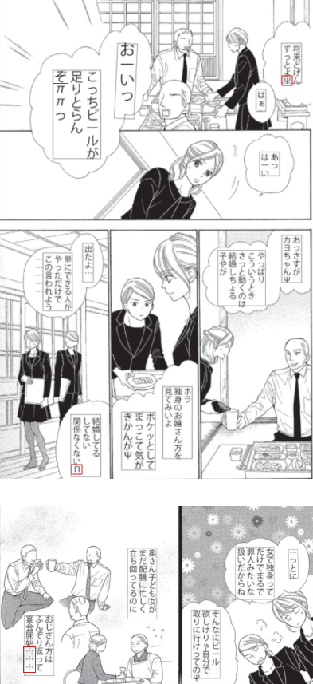
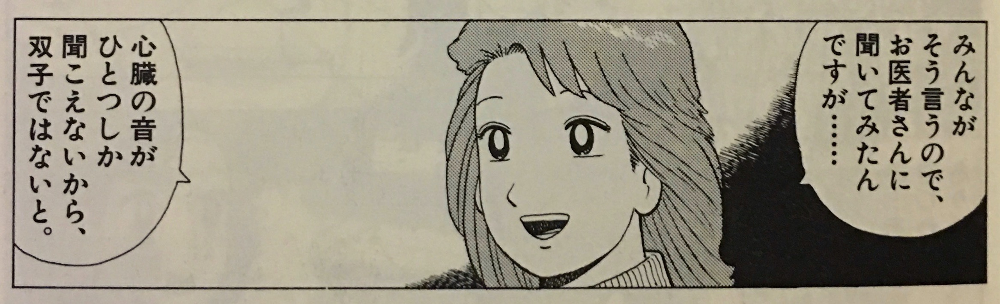
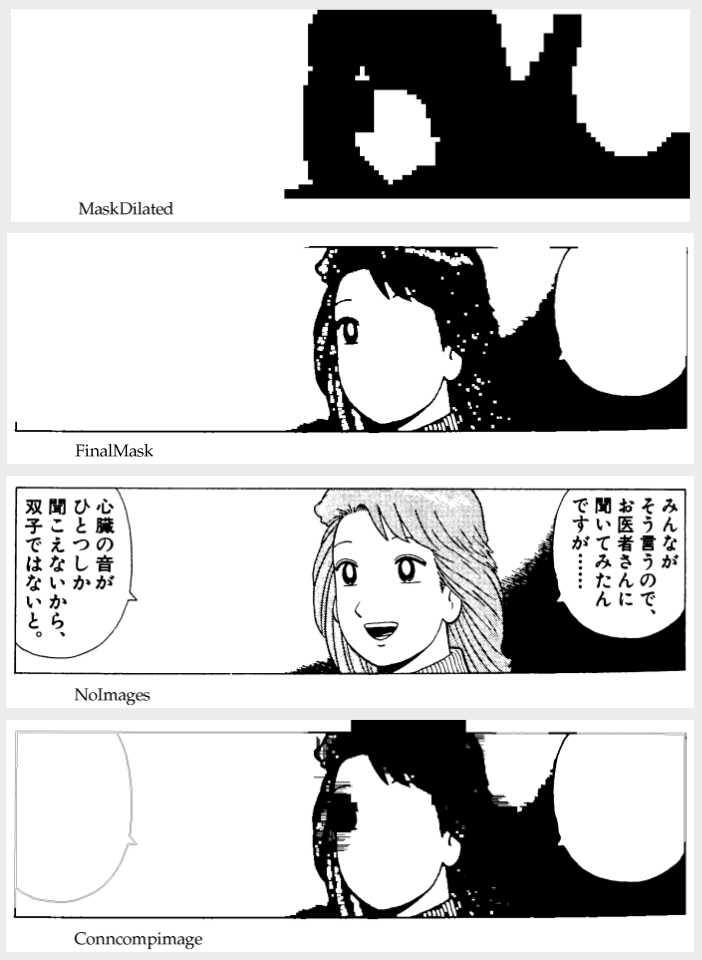

# Vertical Scripts, Tesseract

This CL program has a number of options that can significantly impact how well text is recognized in the image.

There's a lot of technical consideration that goes into the rendering of CJK fonts/scripts vertically:

- <https://www.w3.org/TR/jlreq/>
- <https://www.w3.org/International/tests/repo/results/writing-mode-vertical>
- <https://www.w3.org/International/articles/vertical-text/>

And for background on East Asian scripts:

- <https://en.wikipedia.org/wiki/CJK_Unified_Ideographs>
- <https://en.wikipedia.org/wiki/Horizontal_and_vertical_writing_in_East_Asian_scripts>

And Japanese typographic symbols not included in kana or kanji groups:

- <https://en.wikipedia.org/wiki/List_of_Japanese_typographic_symbols>

also, weird typographic errors in the page:

- <https://japanese.stackexchange.com/questions/77017/what-do-these-symbols-in-manga-mean>



> This seems to be an encoding/typesetting issue and the "symbols" are indeed Greek letters Ψ, Π, π that seem to be displayed instead of !, ?, 〜.
>
> There is another typographical oddity that suggests something went wrong here: the ch­ōonpu (long vowel marker) ー (for example in はーい or おーいっ) should be vertical in vertical writing, but it appears horizontal here.

## Manga and OCR

Someone created a Japanese vertical traineddata file expressly for Manga, <https://github.com/zodiac3539/jpn_vert?files=1>.

## Tuning Tesseract

Playing with the tesseract CL program is a quick way to validate settings like resolution, OEM, and PSM against new images or new kinds of images.  Though I've noticed the CL program results are not always 1:1 with the API; I think the CL does some preprocessing.

Using this image as my sample comic book panel with Japanese text:



The basic command looks like:

```zsh
% tesseract 02-panel.jpg stdout -l jpn_vert
```

Setting the `--dpi` seems to make a big difference in how the text is recognized:

<table>
<tr><td>dpi</td><td>text</td></tr>
<tr>
<td>72</td>
<td>(doesn't do anything)</td>
</tr>

<tr>
<td>70</td>
<td>
<pre>
Estimating resolution as 660
みんなが

そう言うので、
お医者さんに
聞いてみたん

心臓の音が
びとつしか
聞こえないから、
双子ではないと。
</pre>
</td>
</tr>

<tr>
<td>200</td>
<td>
<pre>
みんなが
そう言うので、
お医者さんに
</pre>
</td>
</tr>

<tr>
<td>1000</td>
<td>
<pre>
Detected 3 diacritics


みんなが

そう言うので、
お医者さんに
問いてみたん


心臓の音が
びとつしか
聞こえないから、
双子ではないと。
</pre>
</td>
</tr>
</table>

The results of 70 dpi and 1000 dpi are very close to being equal.  70 is correct, to my eyes, while 1000 differs on the first character of line 4:

<table>
<tr><td>70 dpi</td><td>1000 dpi</td></tr>
<tr>
<td style="font-size:1.5em; background-color: #e6ffed">聞</td>
<td style="font-size:1.5em; background-color: #ffeef0">問</td></tr>
</table>

The text actually looks like it could be correct, and it mostly is.  The glaring exception in the second line being <emphasis style="font-size: 1.25em">ひびひ</emphasis> where it should be <emphasis style="font-size: 1.25em">ひ</emphasis>:

I ran some tests with the tesseract command-line program and found some options which started saving intermediate versions of the image as it passed through the command-line's pre-processes:

```none
tesseract cropped2.jpg stdout -l jpn_vert \
  -c tessedit_display_outwords=1 \
  -c tessedit_dump_pageseg_images=1 \
  -c tessedit_write_images=1 \
  -c textord_debug_tabfind=1 \
  -c textord_show_final_blobs=1 \
  -c textord_show_initial_words=1 \
  -c textord_show_new_words=1 \
  -c textord_tabfind_show_images=1 \
  -c textord_tabfind_show_partitions=1 \
  -c textord_tablefind_show_mark=1 \
  -c textord_tablefind_show_stats=1 \
  -c wordrec_display_segmentations=1 \
  -c wordrec_display_splits=1
```

### Input image

The tesseract command-line pre-processes the input image, at the very least converting to halftone, and it looks like also upscaling (but I'm still foggy on these distinctions).

`-c tessedit_write_images=1` dumps this input image to **tessinput.tif**.

### Page Segmentation

```-c tessedit_dump_pageseg_images=1 -c textord_tabfind_show_images=1``` produce a PDF of the steps in page segmentation:



### Useful parameters for Japanese and Chinese

From [Useful parameters for Japanese and Chinese
](https://tesseract-ocr.github.io/tessdoc/ControlParams.html#useful-parameters-for-japanese-and-chinese):

A [tesseract 3.02](https://groups.google.com/g/tesseract-ocr/c/A4IQlslY7hc/m/d4xK1PoihfMJ?pli=1) user for Japanese scripts noticed these values helped:

| Name                           | Suggested value | Description                                                                                                                       |
|--------------------------------|-----------------|-----------------------------------------------------------------------------------------------------------------------------------|
| chop_enable                    | T               | Chop enable.                                                                                                                      |
| use_new_state_cost             | F               | Use new state cost heuristics for segmentation state evaluation                                                                   |
| segment_segcost_rating         | F               | Incorporate segmentation cost in word rating?                                                                                     |
| enable_new_segsearch           | 0               | Enable new segmentation search path. It could solve the problem of dividing one character to two characters                       |
| language_model_ngram_on        | 0               | Turn on/off the use of character ngram model.                                                                                     |
| textord_force_make_prop_words  | F               | Force proportional word segmentation on all rows.                                                                                 |
| edges_max_children_per_outline | 40              | Max number of children inside a character outline. Increase this value if some of KANJI characters are not recognized (rejected). |

### More Tuning

But for English text, <https://mlichtenberg.wordpress.com/2015/11/04/tuning-tesseract-ocr/>.

Notes on PageSegMode **6**:

- By default, Tesseract fully automates the page segmentation, but does not perform orientation and script detection.  A value of 6 directs Tesseract to assume a single uniform block of text.
- There are no longer extra lines between paragraphs.  However, those lines do not actually appear on the source image either.
The garbage words at the end of the page no longer appear.
- A small number of errors in individual words that appear in the original output were corrected, and a few other incorrect words changed (but were still incorrect).
- `-psm 6` can produce very poor output.  For example, processing of the image found at <http://www.archive.org/download/mobot31753002262522/page/n1> results in a huge amount of garbage output, instead of just a few lines of text.
  - Pages with images produce poor output.  Because this parameter instructs Tesseract to treat everything as a single block of text, images are not recognized as images, and are instead processed as text (resulting in lots of garbage in the OCR).
  - Text on "rotated" pages is not recognized.  In its normal mode, Tesseract is able to automatically normalize the page orientation and detect words.
  - Very poor results for multi-column pages.  In its normal mode Tesseract does a decent job of processing columns of text.
