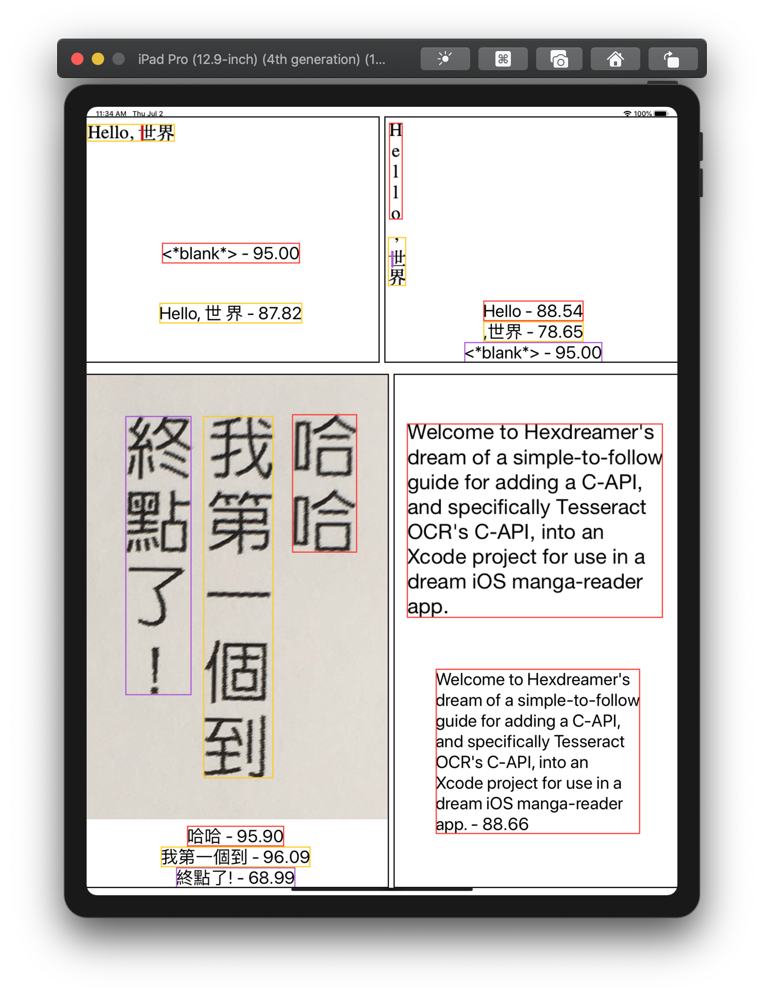
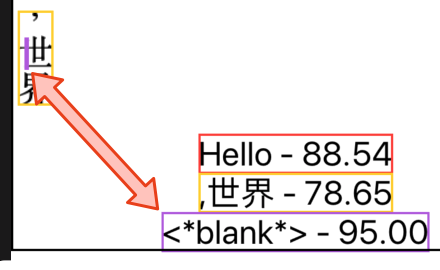
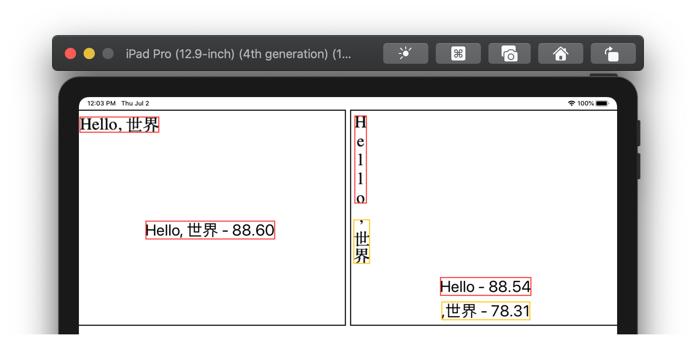

<!-- markdownlint-disable-file MD033 -->
# Multilingual OCR for your for iOS or macOS project

Welcome to our project, **Tesseract OCR in your Xcode Project**.  This will guide you through the process of building Tesseract OCR and using it in your Xcode project, easily.

Like, this *easy*:

1. **git clone** or download this repo
1. **cd** to the repo
1. run **source project_environment.sh**
1. run **$BUILDDIR/build_all.sh**
    1. wait for successful build
1. run **./Scripts/test_tesseract.sh**, to get some language recognition data and test the build
1. open **iOCR/iOCR.xcodeproj**
1. run the **iOCR** target on an iPad Pro 12.9-inch simulator

If you want to learn more about those steps, check out this guide and...

- [Build from source](#build-from-source): get to know this repo's layout; understand the arrangement of the libraries that make up Tesseract OCR; create a build chain; configure and build!
- [Test Tesseract](#test-tesseract): quickly and directly get to using Tesseract by running a small test; also get target language recognition data
- [Write an app](#write-an-app): wrap the Leptonica and Tesseract C-API's into a **very basic** iPad app that shows some recognition features for traditional Chinese, English, and Japanese

## The project environment

This guide refers to the project folder that you cloned/downloaded as **PROJECTDIR**.  All command-line work, paths, and examples are done from this base directory.

The new repo looks pretty bare:

```sh
% ls *
README.md

Root:
README.md  include/

Scripts:
README.md          build/             test_tesseract.sh*

iOCR:
iOCR/           iOCR.xcodeproj/ iOCRTests/
```

- All build products will be installed in **Root**; its **include** already has a modulemap file for our basic Xcode project
- The build scripts are in **Scripts/build**; **test_tesseract.sh** will be covered later in this guide
- **iOCR** is our basic Xcode project

The build scripts will also create new directories&mdash;**Downloads**, **Logs**, **Sources**&mdash;that will be populated with artifacts of the build process.

Let's move on to what we're building, and how it goes together.

## Build from source

The top-level APIs/libraries needed to perform OCR are, in hierarchical order:

- **tesseract**: the main library for performing OCR
  - **leptonica**: a library for managing image data and image manipulation
    - **libjpeg**, **libpng**, **libtiff**: the libraries for the individual image formats

There is additional tooling to support the process of building the top-level libs; packages like **autoconf** and **automake** from GNU.

The final arrangement of the packages we settled on looks like:

1. autoconf
1. automake
1. pkgconfig
1. libtool
1. libjpeg
1. libpng
1. libtiff
1. leptonica
1. tesseract

### Starting the build

For each of the packages above, the build process:

1. downloads a package's TGZ/ZIP to Downloads
1. extracts that TGZ/ZIP to Sources
1. configures and makes that source, then installs those build products into Root

The **Scripts/build** directory contains all the shell scripts to order and execute those steps.  Looking in there:

```zsh
 % ls Scripts/build
build_all.sh*
...
build_leptonica.sh*
build_tesseract.sh*  
...
config-make-install_leptonica.sh
config-make-install_tesseract.sh
...
project_environment.sh
utility.sh
```

Any of the **build_PACKAGE-NAME.sh** scripts can be run by itself.  The top-level libraries also have a **config-make-install** helper script that covers the details of building and installing for multiple architectures and platforms, which we'll cover after we see the completed build.

**build_all.sh** is the build chain; running this one script will produce all the files that we will need for Xcode:

```sh
 % ./Scripts/build/build_all.sh

...
(10-20 minutes later)
...

======== tesseract-4.1.1 ========
Downloading... done.
Extracting... done.
Preconfiguring... done.
ios_arm64: configuring... done, making... done, installing... done.
ios_x86_64: configuring... done, making... done, installing... done.
macos_x86_64: configuring... done, making... done, installing... done.
ios: lipo... done.
macos: lipo... done.
```

After a while, we see that Tesseract was finally configured, made, and installed.  And then there was a final **lipo** step.

The builds are targeted for two different processor *architectures*, **arm64** and **x86_64**.  There are also two different *platform* configurations, **ios** and **macos**.  This results in the following three files for every library, and each is needed for the following use-case:

| lib name                               | use                                |
|----------------------------------------|------------------------------------|
| `Root/ios_arm64/lib/libtesseract.a`    | running on an iOS device           |
| `Root/ios_x86_64/lib/libtesseract.a`   | running in iOS Simulator, on a Mac |
| `Root/macos_x86_64/lib/libtesseract.a` | running on a Mac (AppKit)          |

For iOS, we can use the lipo tool to stitch the files for the two different architectures together, and then we can plug that one lib into Xcode.  But, lipo cannot cannot stitch the same architectures together, so&mdash;even if built with macOS SDK&mdash; the macos_x86_64 lib remains separate.  This will finally leave us with a set of two binary files for each library, and installed to the common location **Root/lib**:

| lipo these architecture_platform libs                                        | into this final lib             |
|------------------------------------------------------------------------------|---------------------------------|
| `Root/ios_arm64/lib/libtesseract.a`<br/>`Root/ios_x86_64/lib/libtesseract.a` | `Root/lib/libtesseract.a`       |
| `Root/macos_x86_64/lib/libtesseract.a`                                       | `Root/lib/libtesseract-macos.a` |

Now that Tesseract is built and installed, we can test it out and see our first payoff.

## Test Tesseract

To get a very quick and basic validation of our hard work, we'll ignore those installed libs for a moment and focus on a command-line (CL) tesseract program that was also built and installed as a part of our process.

For the CL (and lib-based Xcode) Tesseract to work, we need to get the *trained data* for the languages we want recognized.  We'll get Traditional Chinese and Japanese, both for vertical scripts, and English and Japanese, for horizontal.

Run **Scripts/test_tesseract.sh** to download the trained data and run a quick OCR test on these sample images:

<table>
<tr>
<td>

</td>
<td>

</td>
<td>

</td>
<td>

</td>
</tr>
<tr><td>Japanese</td><td>Japanese (vert)</td><td>Chinese (trad, vert)</td><td>English</td></tr>
</table>

```sh
% ./Scripts/test_tesseract.sh
# Checking for trained data language files...
downloading chi_tra.traineddata...done
downloading chi_tra_vert.traineddata...done
downloading eng.traineddata...done
downloading jpn.traineddata...done
downloading jpn_vert.traineddata...done
# Recognizing sample images...
testing Japanese...passed
testing Japanese (vert)...passed
testing Chinese (trad, vert)...passed
testing English...passed
```

And with that little test completed, we can get into Xcode.

## Write an app

If you're not familiar with the Tesseract C-API, here are the basics with figurative code samples.

### Tesseract API basis

#### Initialize API object

Create an API object and initialize it with the trained data's parent folder, the data's filename, and an *OCR engine mode (OEM)*.  **OEM_LSTM_ONLY** is the latest neural-net recognition engine, which has some advantage in text-line recognition over the previous engine.

```swift
tessAPI = TessBaseAPICreate()
TessBaseAPIInit2(tessAPI, trainedDataFolder, "jpn_vert", OEM_LSTM_ONLY)
```

#### Perform OCR

Get an image and set it on the API, then configure the resolution and *page segmentation mode (PSM)*.  By default, Tesseract expects a page of text when it segments an image, and **PSM_AUTO** defines this default behavior.  All the images in this guide have been cropped to just the text, so this value makes sense for most of samples in this demo/guide.

```swift
image = getImage("japanese_vertical_sample")
TessBaseAPISetImage2(tessAPI, image)
TessBaseAPISetSourceResolution(tessAPI, 144)
TessBaseAPISetPageSegMode(tessAPI, PSM_AUTO)
```

Finally, call the method that returns the recognized text in the image.

```swift
TessBaseAPIGetUTF8Text(tessAPI)
```

We could stop here, but there's more we can know about the text.

#### Iterate over results

The API also provides an iterator for individually recognized objects in the image.  The size or scope of the object is determined by *level*.  **RIL_TEXTLINE** is the *ResultIteratorLevel* for working with individual lines of text.

```swift
level = RIL_TEXTLINE
iterator = TessBaseAPIGetIterator(tessAPI)

while (TessPageIteratorNext(iterator, level) > 0) {
  txt = TessResultIteratorGetUTF8Text(iterator, level)
  TessPageIteratorBoundingBox(iterator, level, &originX, &originY, &width, &height)
  confidence = TessResultIteratorConfidence(iterator, level)
}
```

*Note:* `TessBaseAPIGetUTF8Text` must be called ***before*** the `TessPageIterator` and `TessResultIterator` methods.

There is a small test and working example of these basics in **iOCRTests.swift::testGuideExample()** in the Xcode project.

### iOCR Xcode project

**PROJECTDIR/iOCR/iOCR.xcodeproj** is an example of putting everything together into a working project and running an app in the simulator that highlights those API basics.

Open the project and run the **iOCR** target for an **iPad Pro (12.9-in)**:



The colored rectangles, texts, and numbers are the iterated bounding boxes, utf8 texts, and confidence scores from the basics section and are now wrapped up in a **RecognizedRectangle**:

```swift
struct RecognizedRectangle {
    public var text: String
    public var boundingBox: CGRect
    public var confidence: Float
}
```

and this struct is handled with the **Recognizer** class which exposes two main methods for getting plain text or RecognizedRectangles:

```swift
let recognizer = Recognizer(imgName: "japanese_vert", trainedDataName: "jpn_vert", imgDPI: 144)


print recognizer.getAllText()

  (String) $R2 = "Hello\n\n,世界\n"


print recognizer.getRecognizedRects()

  ([iOCR.RecognizedRectangle]) $R8 = 2 values {
    [0] = {
      text = "Hello\n\n"
      boundingBox = (origin = (x = 9, y = 12), size = (width = 22, height = 166))
      confidence = 88.5363388
    }
    [1] = {
      text = ",世界\n"
      boundingBox = (origin = (x = 7, y = 210), size = (width = 30, height = 83))
      confidence = 78.3088684
    }
}
```

#### A weird rectangle and \<\*blank\*\>

In the Japanese sample images, we can see the text value `<*blank*>` with a confidence of 95.00%.  Those values correspond to the unexpected recognition of a single stroke inside the <span style="font-size: 1.25em">世</span> character as a whole other valid character, weird...



but completely avoidable with only a little more understanding of the images.

The Japanese sample images were initially created for the demo like so:

```swift
var jpn = Recognizer(imgName: "japanese", trainedDataName: "jpn")
var jpn_vert = Recognizer(imgName: "japanese_vert", trainedDataName: "jpn_vert")
```

which uses a default DPI of 72.  These images have a DPI of 144, though.

#### Better configuration is better recognition

Simply add the correct DPI to the Recognizer:

```swift
var jpn = Recognizer(imgName: "japanese", trainedDataName: "jpn", imgDPI: 144)
var jpn_vert = Recognizer(imgName: "japanese_vert", trainedDataName: "jpn_vert", imgDPI: 144)
```

and it just works!



This little problem-and-solution set starts to highlight some of the internal workings of Tesseract.

#### Learning Tesseract

Configuration can matter a lot for Tesseract.  If you're new to it, you might need to dig in if you don't immediately get good results.  Here are two resources we've consulted:

- **Is there a Minimum / Maximum Text Size? (It won’t read screen text!)**  <https://tesseract-ocr.github.io/tessdoc/FAQ-Old#is-there-a-minimum--maximum-text-size-it-wont-read-screen-text>

- **Improving the quality of the output** <https://tesseract-ocr.github.io/tessdoc/ImproveQuality>
