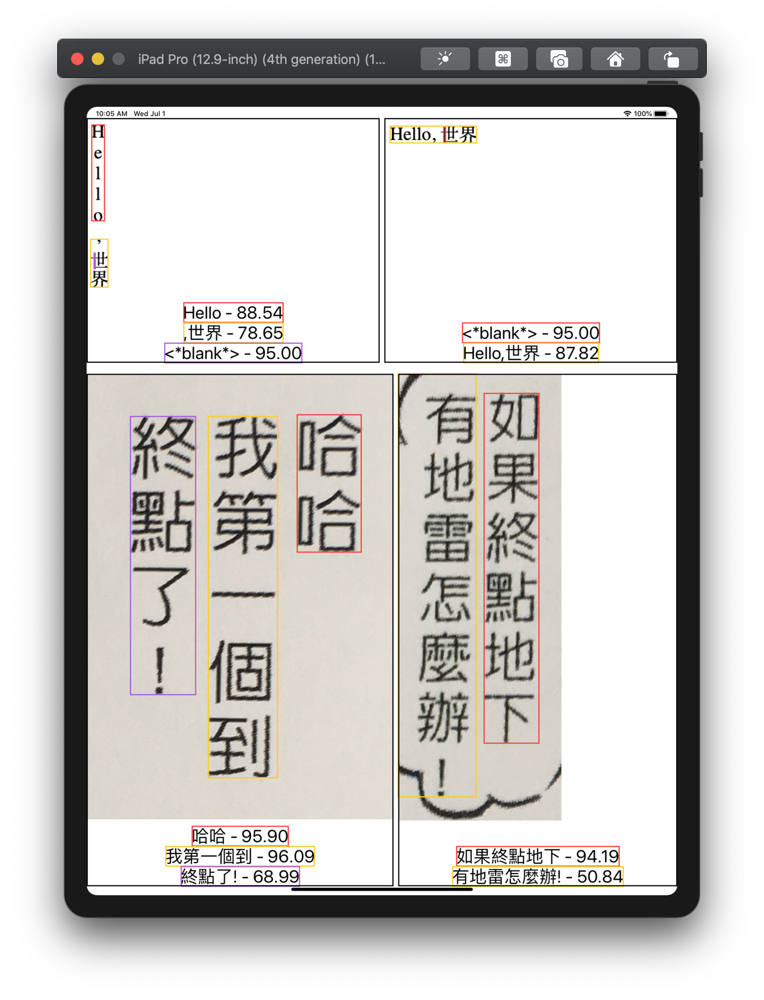
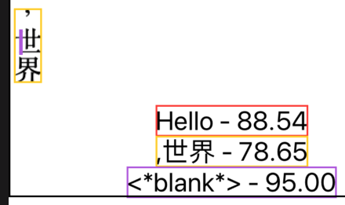

# Multilingual OCR for your for iOS or macOS project

Welcome to our guide to building and using Tesseract OCR in an Xcode project.  We started this project with the very strong philosophy that it should be easy to learn how to build a C or C++ library from source and then integrate the build products into an app.

The repo contains:

- a skeleton folder structure for downloading and building the tools and libraries, which includes
  - all the configuration and build scripts
- a simple test of the build phase
- an Xcode project that imports the libraries and modules, and a basic iPad app that can recognize vertical Japanese and traditional Chinese

## Building from source

The Tesseract OCR library manages its image data with Leptonica, a library that manipulates common image file formats.  And Leptonica is built upon the individual libraries for the different image formats.  In building the image libraries, Leptonica, and then Tesseract, we'll need some additional tools like autoconf and automake, from GNU.  The final arrangement of the tools and libraries I settled on looks like:

1. autoconf
1. automake
1. pkgconfig
1. libtool
1. zlib
1. libjpeg
1. libpng
1. libtiff
1. leptonica
1. tesseract

This guide refers to the project folder that you cloned or downloaded as **PROJECTDIR**, which comes with three empty directories that the build process will fill by:

1. downloading a TGZ to **Downloads**
1. extracting the TGZ to **Sources**
1. configuring and making the source, and installing into **Root**

The **Scripts** directory contains all the shell scripts to order and execute those steps.

From my PROJECTDIR, I source the project's environment into my shell, which also prints out some key elements of the environment:

```zsh
% source project_environment.sh

Directories:
$PROJECTDIR:  /Users/zyoung/dev/tesseract-build
$DOWNLOADS:   /Users/zyoung/dev/tesseract-build/Downloads
$ROOT:        /Users/zyoung/dev/tesseract-build/Root
$SCRIPTSDIR:  /Users/zyoung/dev/tesseract-build/Scripts
$BUILDDIR:    /Users/zyoung/dev/tesseract-build/Scripts/build
$SOURCES      /Users/zyoung/dev/tesseract-build/Sources

Scripts:
$BUILDDIR/build_all.sh         clean|run all configure/build scripts
$SCRIPTSDIR/test_tesseract.sh  after build, run a quick test of tesseract

Functions:
print_project_env  print this listing of the project environment
```

The master build script, **BUILDDIR/build_all.sh**, runs all the individual build scripts for the tools and libraries (which is identical to the 10-point list from above).  

Running that one script will produce all the files that we will eventually need for Xcode:

```zsh
 % ./Scripts/build/build_all.sh

...

...

======== tesseract-4.1.1 ========
Downloading... done.
Extracting... done.
Preconfiguring... done.
ios_arm64: configuring... done, making... done, installing... done.
ios_x86_64: configuring... done, making... done, installing... done.
macos_x86_64: configuring... done, making... done, installing... done.
ios: lipo... done.
macos: lipo... done.
```

The builds are targeted for two different processor *architectures*, **arm64** and **x86_64**.  There are also two different *platform* configurations, **ios** and **macos**.  This results in the following three files for every library, and each is needed for the stated uses:

| lib name                            | use                                |
|-------------------------------------|------------------------------------|
| `Root/ios_arm64/lib/libname.a`    | running in iOS                     |
| `Root/ios_x86_64/lib/libname.a`   | running in iOS Simulator, on a mac |
| `Root/macos_x86_64/lib/libname.a` | running on a mac                   |

Xcode's **lipo** tool can stitch files from different architectures together, but it cannot stitch the same architectures together.  This will finally leave us with a set of two binary files for each library, and installed to the common location **Root/lib**:

| lipo these formatted libs                                        | into this final lib            |
|--------------------------------------------------------------------|---------------------------|
| `Root/ios_arm64/lib/libname.a` <br/> `Root/ios_x86_64/lib/libname.a` | `Root/lib/libname.a`       |
| `Root/macos_x86_64/lib/libname.a`                                   | `Root/lib/libname-macos.a` |

## Verifying Tesseract

Having run **build_all.sh** and successfully built Tesseract we need to provide it with the reference data it will use to recognize the characters in the language we are interested in.

Run **Scripts/test_tesseract.sh** to download some trained data for horizontal and vertical Japanese scripts, vertical traditional Chinese scripts, and run a quick OCR test on these 2 images:

|  |  |
|-------------------------------------------------------|-----------------------------------------------------|

```zsh
% ./Scripts/test_tesseract.sh
test horizontal: passed
test vertical: passed
```

The actual text recognized in the vertical image is:

```none
Hello

,世界

```

but for this simple test, all white space is stripped out and the result is compared to `'Hello,世界'` (which is also the expected result for the horizontal image).

These images were chosen because some Japanese writing will include words borrowed from English, and I think it's noteworthy that some English is recognized when processing exclusively for Japanese.

And with that little test completed, we can get into Xcode.

## A simple OCR app

If you're not familiar with the Tesseract C-API, here are some of the basics I've learned with figurative code samples.

### Tesseract API basis

#### Initialize API object

Create an API object and initialize it with the trained data's parent folder, the data's filename, and an *OCR engine mode (OEM)*.  **OEM_LSTM_ONLY** is the latest neural-net recognition engine, which has some advantage in "line recognition" over the previous engine.

```swift
tessAPI = TessBaseAPICreate()
TessBaseAPIInit2(tessAPI, trainedDataFolder, "jpn_vert", OEM_LSTM_ONLY)
```

#### Perform OCR

Get an image and set it on the API, then configure the resolution and *page segmentation mode (PSM)*.  By default, Tesseract expects a page of text when it segments an image, and **PSM_AUTO** defines this default behavior.  All the images in this guide have been cropped to just the text, so this value makes sense for this demo/guide.

```swift
image = getImage()
TessBaseAPISetImage2(tessAPI, image)
TessBaseAPISetSourceResolution(tessAPI, 72)
TessBaseAPISetPageSegMode(tessAPI, PSM_AUTO)
```

Finally, call the method that returns the recognized text in the image.

```swift
TessBaseAPIGetUTF8Text(tessAPI)
```

We could stop here, but there's more we can know about the text.

#### Iterate over results

The API also provides an iterator for individually recognized text elements in the image.  The size or scope of the elements is determined by *level*.  **RIL_TEXTLINE** is the ResultIteratorLevel for recognizing individual lines of text.  `TessBaseAPIGetUTF8Text()` from before uses `RIL_PARA` internally to recognize paragraphs of text.

```swift
level = RIL_TEXTLINE
iterator = TessBaseAPIGetIterator(tessAPI)

while (TessPageIteratorNext(iterator, level) > 0) {
  txt = TessResultIteratorGetUTF8Text(iterator, level)
  TessPageIteratorBoundingBox(iterator, level, &originX, &originY, &width, &height)
  confidence = TessResultIteratorConfidence(iterator, level)
}
```

*Note:* `TessBaseAPIGetUTF8Text` must be called before the `TessPageIterator` and `TessResultIterator` methods.

There is a small test and working example of these basics in **iOCRTests.swift::testGuideExample()** in the Xcode project.

### iOCR Xcode project

**PROJECTDIR/iOCR/iOCR.xcodeproj** is an example of putting everything together into a working project and running an app in the simulator that highlights those API basics.

Open the project and run the **iOCR** target for an **iPad Pro (12.9-in)**:



The colored rectangles, texts, and numbers are the iterated bounding boxes, utf8 texts, and confidence scores from the basics section and now wrapped up in `recognizedRects`:

```swift
class Recognizer {
    let img: UIImage
    let allTxt: String
    let recognizedRects: [RecognizedRectangle]

    init(
        trainedData: String,
        imgName: String,
        level: TessPageIteratorLevel
    ) {
        self.img = UIImage(named: imgName)!
        let tessAPI = initAPI(langDataName: trainedData, uiImage: self.img)

        var txt = getAllText(tessAPI: tessAPI)
        if (txt.filter { !$0.isWhitespace } == "") {
            txt="<*blank*>"
        }
        self.allTxt = txt

        self.recognizedRects = recognizedRectangles(tessAPI: tessAPI, level: level)

        deInitAPI(tessAPI: tessAPI)
    }
}
```

and in the case of the English panel in the bottom-right corner, the view's `recognizer` is created in this fashion:

```swift
var recognizer = Recognizer(trainedData: "eng", imgName: "hexdreams_english", level:RIL_PARA)
```

#### Some weird geometry and \<\*blank\*\>

In the Japanese sample image, there's the text value `<*blank*>` with a confidence of 95.00%.  Those values correspond to the unexpected recognition of a single stroke inside the <span style="font-size: 1.5em">世</span> character as a whole other valid character(s), weird.



That possibility is covered in `Recognizer` above with the `if (txt.filter { !$0.isWhitespace } == "")` check.

## Learning Tesseract

Configuration can matter a lot for Tesseract.  If you're new to it, you might need to dig in if you don't immediately get good results.  Here are two resources I've consulted:

- **Is there a Minimum / Maximum Text Size? (It won’t read screen text!)**  [https://tesseract-ocr.github.io/tessdoc/FAQ-Old#is-there-a-minimum--maximum-text-size-it-wont-read-screen-text]

- **Improving the quality of the output** [https://tesseract-ocr.github.io/tessdoc/ImproveQuality]
