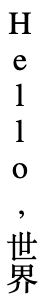
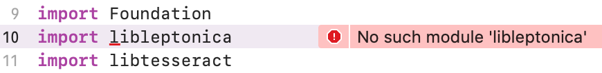
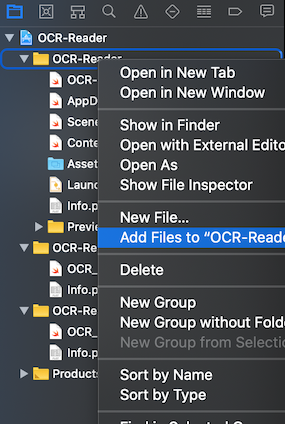
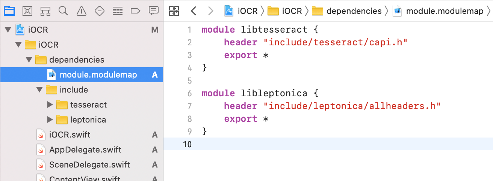
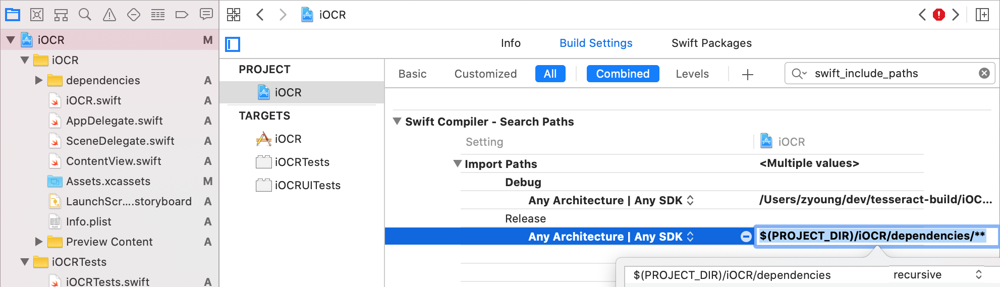
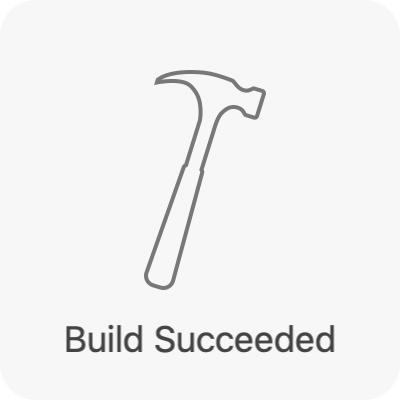

# Making an OCR app for iOS or macOS, from scratch

Welcome to our project on building and using Tesseract OCR in your Xcode projects.  We started this project with the very strong philosophy that it should be easy to learn how to build a C or C++ library from source and then build an app on top of that.

As the person tasked with creating this guide, I didn't know, and still don't know how to do a lot of what this guide requires.  C is familiar, but I don't know it.  I've used Xcode before, but that was like 10 years ago and I didn't have to deal with libraries, targets, and most of the details that go into making this project.  And if that sounds familiar and your unsure, hopefully this can guide you forward.

## Building from source

The Tesseract OCR library manages its image data with Leptonica, a library that manipulates common image file formats.  And Leptonica is built upon the individual libraries for the different image formats.  In building the image libraries, Leptonica, and then Tesseract, we'll need some additional tools like autoconf and automake, from GNU.  The final arrangement of the tools and libraries I settled on looks like:

1. autoconf
1. automake
1. pkgconfig
1. libtool
1. zlib
1. libjpeg
1. libpng
1. libtiff
1. leptonica
1. tesseract

The project folder that you cloned or downloaded is referred to as **PROJECTDIR** and comes with three empty directories that the build process will fill up like: download TGZ to **Downloads**; extract TGZ to **Sources**; configure and make source, and install into **Root**.  The **Scripts** directory contains all the shell scripts to order and execute those steps.

For my folder setup, I did everything in the shell and Xcode relative to my PROJECTDIR.  There's a symlink to shell script we can source to set up the shell environment and the `print_project_env()` function that shows key aspects of the environment:

```zsh
% cd ~/dev/tesseract-build

% ls -la project_environment.sh
lrwxr-xr-x  1 zyoung  staff  36 Jun 24 11:38 project_environment.sh@ -> Scripts/build/project_environment.sh

% source project_environment.sh
% print_project_env

Directories:

$PROJECTDIR:  /Users/zyoung/dev/tesseract-build
$DOWNLOADS:   /Users/zyoung/dev/tesseract-build/Downloads
$ROOT:        /Users/zyoung/dev/tesseract-build/Root
$SCRIPTSDIR:  /Users/zyoung/dev/tesseract-build/Scripts
$SOURCES      /Users/zyoung/dev/tesseract-build/Sources

Scripts:

$BUILDDIR/build_all.sh         clean|run all build/configure scripts
$SCRIPTSDIR/test_tesseract.sh  after build, run a quick test of tesseract
```

Take a moment to check out the master build script, `$BUILDDIR/build_all.sh`  The script contains an option to clean PROJECTDIR, and then runs a list of build scripts (which is identical to the list of libraries/tools from above).

Just running that one script will produce all the files we need for Xcode.  Running it takes me about 20 minutes.  I've configured those files so they are divided into 3 formats that I've defined: **ios_arm64**, **ios_x86_64**, **macos_x86_64**.  `lipo` stitches the two-iOS formatted files into one multi-arch binary, **libname.a**; and writes the one macOS-formatted file to a single-arch binary, **libname-macos.a**.

| lipo these formatted libs                                        | into this final lib            |
|--------------------------------------------------------------------|---------------------------|
| `<Root>/ios_arm64/lib/libname.a` <br/> `<Root>/ios_x86_64/lib/libname.a` | `<Root>/lib/libname.a`       |
| `<Root>/macos_x86_64/lib/libname.a`                                   | `<Root>/lib/libname-macos.a` |

The two header files for Leptonica and Tesseract C-APIs that we need are 

There's also a tesseract command-line program that we'll use, and it's in macos_x86_64.
The build steps and these concepts are explained in more detail in [Building](Scripts/README.md#Building).

## Verifying Tesseract

Having run **build_all.sh** and successfully built Tesseract we need to provide it with the reference data it will use to recognize the characters in the language we are interesed in.

Run **Scripts/test_tesseract.sh** to download some trained data for horizontal and vertical Japanese scripts and run a quick OCR test on these 2 images:

|  |  |
|-------------------------------------------------------|-----------------------------------------------------|

```zsh
% ./Scripts/test_tesseract.sh
test horizontal: passed
test vertical: passed
```

The actual text recognized in the vertical image is:

```none
Hello

,世界

```

but for this simple test, all white space is stripped out and the result is compared to `'Hello,世界'` (which is also the expected result for the horizontal image).

These images were chosen because some Japanese writing will include English loan words and I think it's noteworthy that some English is recognized when processing exclusively for Japanese.

And with that little test completed, we can get into Xcode.

## Integrating Tesseract into Xcode

Much of the insight into configurating and executing the build up to this point came from the Makefile of another open-source iOS Tesseract project, SwiftyTesseract (ST), *A Swift wrapper around Tesseract for use in iOS applications*.  I've used it as a model for building with Swift on top of a C API.  I'll be using bits of ST code to navigate creating an Xcode project from scratch.  I'll chase down errors as they come, modifying the project along the way.

### Create the project

1. **File** &rarr; **New Project**

1. A **Single View App** is a great template for this guide, **Next**

1. Add **Product Name**, I've named mine *iOCR*, **Next**

1. Choose your project's location, I chose `$PROJECTDIR`, **Create**

### Write a bit of code

1. **File** &rarr; **New** &rarr; **File...**

1. Choose **Swift File**, **Next**

1. **Save As:** **iOCR**, **Group: iOCR (folder under iOCR project)**, **Create**

1. Insert this snippet into **iOCR.swift**:

    ```swift
    import libleptonica
    import libtesseract
    ```

1. Save that file, and my first error is:

    ```none
    No such module 'libleptonica'
    ```

    <!---->
    

### No such module

Our two libraries, Leptonica and Tesseract, need to be copied into the project and made known to Xcode as 2 different modules.

1. Copy over the headers into a new **dependencies** folder:

    ```zsh
    ditto $ROOT/include/leptonica iOCR/iOCR/dependencies/include/leptonica
    ditto $ROOT/include/tesseract iOCR/iOCR/dependencies/include/tesseract
    ```

    I'm ignoring the libs for now because the error is about modules.

1. Right-click the iOCR folder in the project navigator and choose **Add Files to "iOCR"**:

    

1. Select the folder **iOCR/iOCR/dependencies**, check that **Create groups** is selected, **Add**

1. **File** &rarr; **New...** &rarr; **File**, scroll down to **Other** and choose **Empty**

1. Create **iOCR/iOCR/dependencies/module.modulemap**, in the **Group: dependencies**, with the following contents:

    ```swift
    module libtesseract {
        header "include/tesseract/capi.h"
        export *
    }

    module libleptonica {
        header "include/leptonica/allheaders.h"
        export *
    }
    ```

1. My project now looks like:

    

1. Set the **SWIFT_INCLUDE_PATHS** in the project's build settings to **$(PROJECTDIR)/iOCR/dependencies/\*\***:

    

    Xcode converts the **/\*\*** part at the end of the path to that **recursive** value in the bottom-right of image.

1. **Product** &rarr; **Build**, and that error is cleared:

    