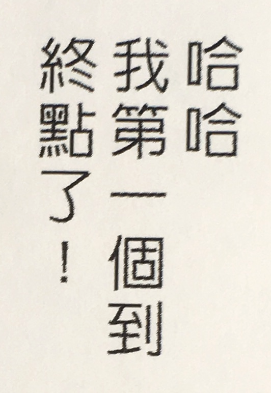

<!-- markdownlint-disable-file MD033 -->
# Multilingual OCR for Swift and your iOS/macOS project

Welcome to our project, **Tesseract OCR in your Xcode Project**.  This will guide you through the process of building the Tesseract OCR library and using its API from Swift in your Xcode project, easily.

Like, this *easy*:

1. **git clone** or download this repo
1. **cd** to the repo
1. run **./Scripts/build/build_all.sh**
    1. wait for successful build
1. run **./Scripts/test_tesseract.sh**, to get some language recognition data and test the build
1. open **iOCR/iOCR.xcodeproj**
1. run the **iOCR** target on an iPad Pro 12.9-inch simulator

If you want to learn more about those steps, check out this guide and...

- [Learn about your environment](#the-project-environment): get to know this repo's layout
- [Build from source](#build-from-source): understand the arrangement of the libraries that make up Tesseract OCR; create a build chain; configure and build!
- [Test Tesseract](#test-tesseract): quickly and directly get to using Tesseract by running a small test; also get target language recognition data
- [Write an app](#write-an-app): wrap the Leptonica and Tesseract C-API's in Swift and make a very basic iPad app that shows some recognition features for traditional Chinese, English, and Japanese

## The project environment

This guide refers to the project directory that you cloned/downloaded as **PROJECTDIR**.  All command-line work, paths, and examples are from this base directory.

The new repo looks pretty bare:

```sh
% ls *
README.md

Notes:
static/

Root:
README.md  include/

Scripts:
README.md          build/             test_tesseract.sh*

iOCR:
iOCR/           iOCR.xcodeproj/ iOCRTests/
```

- All build products will be installed in **Root**; the **include** directory already has a modulemap file for our basic Xcode project
- The build scripts are in **Scripts/build**; **test_tesseract.sh** will be covered later in this guide
- **iOCR** is our basic Xcode project in Swift
- **Notes** contains some static images for the READMEs

The build scripts will also create new directories&mdash;**Downloads**, **Logs**, **Sources**&mdash;that will be populated with artifacts of the build process.

Let's move on to what we're building, and how it goes together.

## Build from source

The *top-level libraries* needed to perform OCR are, in hierarchical order:

- **tesseract**: the main library for performing OCR
  - **leptonica**: a library for managing image data and image manipulation
    - **libjpeg**, **libpng**, **libtiff**: the libraries for the individual image formats

There is additional tooling to support the process of building the top-level libs, packages like **autoconf** and **automake** from GNU.

The final arrangement of the packages we settled on looks like:

1. autoconf
1. automake
1. pkgconfig
1. libtool
1. libjpeg
1. libpng
1. libtiff
1. leptonica
1. tesseract

### Starting the build

For each of the packages above, the build process is:

1. downloads a package's TGZ/ZIP to Downloads
1. extracts that TGZ/ZIP to Sources
1. configures and makes that source, then installs those build products into Root

The **Scripts/build** directory contains all the shell scripts to execute those three steps.  Looking in there:

```sh
 % ls Scripts/build
build_all.sh*
...
build_leptonica.sh*
build_tesseract.sh*  
...
config-make-install_leptonica.sh
config-make-install_tesseract.sh
...
project_environment.sh
utility.sh
```

Any of the **build_PACKAGE-NAME.sh** scripts can be run by itself.  The top-level libraries also have a **config-make-install** helper script that covers the details of building and installing for multiple architectures and platforms, which we'll cover after we see the completed build.

**build_all.sh** is the build chain; running this one script will produce all the files that we will need for Xcode:

```none
 % ./Scripts/build/build_all.sh

...
(some time later)
...

======== tesseract-4.1.1 ========
Downloading... done.
Extracting... done.
Preconfiguring... done.
--**!!**-- Overriding $SOURCES/tesseract-4.1.1/config/config.sub
ios_arm64: configuring... done, making... done, installing... done.
ios_arm64_sim: configuring... done, making... done, installing... done.
ios_x86_64_sim: configuring... done, making... done, installing... done.
macos_x86_64: configuring... done, making... done, installing... done.
macos_arm64: configuring... done, making... done, installing... done.
lipo: ios... done.
lipo: sim... done.
lipo: macos... done.
tesseract command-line: copying... sym-linking to arm64 binary... done.
```

After a while, we see that Tesseract was finally configured, made, and installed.  And then there was a final **lipo** step.

The builds are targeted for two different processor *architectures*, **arm64** and **x86_64**.  There are also three different *platform* configurations, **ios**, **macos**, and **ios_sim** (simulator).  This results in the following three files for every library, and each is needed for the following use-case:

| lib name                                 | use                                       |
|------------------------------------------|-------------------------------------------|
| `Root/ios_arm64/lib/libtesseract.a`      | running on an iOS device                  |
| `Root/ios_arm64_sim/lib/libtesseract.a`  | running in iOS Simulator, on an M1 Mac    |
| `Root/ios_x86_64_sim/lib/libtesseract.a` | running in iOS Simulator, on an Intel Mac |
| `Root/macos_arm64/lib/libtesseract.a`    | running on an M1 Mac (AppKit)             |
| `Root/macos_x86_64/lib/libtesseract.a`   | running on an Intel Mac (AppKit)          |

For iOS, we can use the lipo tool to stitch the files for the two different architectures (arm64 and x86_64) together, and then we can plug that one lib into Xcode.  This will finally leave us with a set of three binary files for each library, and installed to the common location **Root/lib**:

| lipo these architecture_platform libs                                                  | into this final lib             |
|----------------------------------------------------------------------------------------|---------------------------------|
| `Root/ios_arm64/lib/libtesseract.a`                                                    | `Root/lib/libtesseract-ios.a`   |
| `Root/ios_arm64_sim/lib/libtesseract.a` <br/> `Root/ios_x86_64_sim/lib/libtesseract.a` | `Root/lib/libtesseract-sim.a`   |
| `Root/macos_x86_64/lib/libtesseract.a` <br/> `Root/macos_arm64/lib/libtesseract.a`     | `Root/lib/libtesseract-macos.a` |

Now that Tesseract is built and installed, we can test it out and see some payoff for all this hard work.

## Test Tesseract

To get a very quick and basic validation of our hard work, we'll ignore those installed libs for a moment and focus on a command-line (CL) tesseract program that was also built and installed as a part of our process.

For the CL (and lib-based Xcode) Tesseract to work, we need to get the *trained data* for the languages we want recognized.  We'll get Traditional Chinese (vertical), Japanese (horizontal and vertical), and English.

The data is downloaded to **Root/share/tessdata**.  For this test, the data is made known to the CL tesseract program by exporting an environment variable, `export TESSDATA_PREFIX=$ROOT/share/tessdata`, in the test script.

Run **Scripts/test_tesseract.sh** to download the trained data and run a quick OCR test on these sample images:

<table>
<tr>
<td>

</td>
<td>

</td>
<td>

</td>
<td>

</td>
</tr>
<tr>
<td>Chinese (trad, vert)</td>
<td>Japanese</td>
<td>Japanese (vert)</td>
<td>English</td></tr>
</table>

```sh
% ./Scripts/test_tesseract.sh
# Checking for trained data language files...
downloading chi_tra.traineddata...done
downloading chi_tra_vert.traineddata...done
downloading eng.traineddata...done
downloading jpn.traineddata...done
downloading jpn_vert.traineddata...done
# Recognizing sample images...
testing Japanese...passed
testing Japanese (vert)...passed
testing Chinese (trad, vert)...passed
testing English...passed
```

And with that little test completed, we can get into Xcode.

## Write an app

The main API for Tesseract is in C++, but Swift doesn't support C++.  Swift does support C APIs, and Tesseract also has a C-API, so we'll use that. 

If you're not familiar with the Tesseract API, here are the basics with figurative code samples.

### Tesseract API basics, in Swift

The following Swift excerpts were taken from **testGuideExample()** in **iOCR/iOCRTests/iOCRTests.swift**.  We'll also ignore the destroy/teardown code.

#### Initialize API handler

Create an API handler and initialize it with the trained data's parent folder, the trained data's language name, and an *OCR engine mode (OEM)*.  **OEM_LSTM_ONLY** is the latest neural-net recognition engine, which has some advantage in text-line recognition over the previous engine.

```swift
let tessAPI = TessBaseAPICreate()!
TessBaseAPIInit2(tessAPI, trainedDataFolder, "jpn_vert", OEM_LSTM_ONLY)
```

**TessBaseAPIInit2()** is one of 4 API initializers, and lets us set the OEM.

For the API to be able to find the **tessdata** parent-folder, we added **Root/share** as a folder reference, then:

```swift
let trainedDataFolder = Bundle.main.path(
            forResource: "tessdata", ofType: nil, inDirectory: "share")
```

#### Prepare the image

We use **TessBaseAPISetImage2()** to set the image, and that API requires the image to be in Leptonica's **PIX** format, so we need to get a pointer to a byte string of some UIImage data and pass that pointer to **pixReadMem()**:

```swift
let uiImage = UIImage(named: "japanese_vert")!
let data = uiImage.pngData()!
let rawPointer = (data as NSData).bytes
let uint8Pointer = rawPointer.assumingMemoryBound(to: UInt8.self)

var image = pixReadMem(uint8Pointer, data.count)
```

#### Image settings & Perform OCR

Set our image, the resolution, and *page segmentation mode (PSM)*.  PSM defines how Tesseract sees or treats the image, like 'Assume a single column of text of variable sizes' or 'Treat the image as a single word'.  All the images in this guide have been cropped to just the text, and letting Tesseract figure this out for itself (**PSM_AUTO**) works just fine:

```swift
TessBaseAPISetImage2(tessAPI, image)
TessBaseAPISetSourceResolution(tessAPI, 144)
TessBaseAPISetPageSegMode(tessAPI, PSM_AUTO)
```

Finally, we call the **GetUTF8Text** method which runs the recognize functions inside Tesseract, and get some text back:

```swift
let txt = TessBaseAPIGetUTF8Text(tessAPI)
```

and looking at the result in the debugger:

```none
print String(cString: txt!)

  (String) $R3 = "Hello\n\n,世界\n"
```

We could stop here, but there's more we can know about the text.

#### Iterate over results

The API can recognize varying *levels* of text in this top-down order: blocks, paragraphs, lines, words, symbols.  **RIL_TEXTLINE** is the *ResultIteratorLevel* for working with individual lines of text.  Here we're using a textline iterator and getting the (x1,y1) and (x2,y2) coordinates of the recognized line's bounding box:

```swift
let iterator = TessBaseAPIGetIterator(tessAPI)
let level = RIL_TEXTLINE

var x1: Int32 = 0
var y1: Int32 = 0
var x2: Int32 = 0
var y2: Int32 = 0

TessPageIteratorBoundingBox(iterator, level, &x1, &y1, &x2, &y2)
```

*Note:* `TessBaseAPIGetUTF8Text()` or `TessBaseApiRecognize()` must be called ***before*** the `TessPageIterator` and `TessResultIterator` methods.

There is a small test and full working example of these basics in **iOCRTests.swift::testGuideExample()**, in the following Xcode project.

### iOCR Xcode project

**PROJECTDIR/iOCR/iOCR.xcodeproj** is an example of putting everything together into a working project and running an app in the simulator that shows off those API basics.

Open the project and run the **iOCR** target for an **iPad Pro (12.9-in)** (some of the UI was coded specifically for that device's screen size).


<!--
We can also see between horizontal and vertical Japanese, and vertical Chinese, that the results of a "line" varies depending on some combination of language and the text's orientation:

- In the horizontal Japanese and vertical Chinese examples, we get what we'd expect
- In the vertical Japanese example, <span style="font-size: 1.1em">Hello</span> and <span style="font-size: 1.1em">,世界</span> are recognized as two separate lines
-->

Each of the four cards consists of a sample image against a gray background; images were run through Tesseract at the **TEXTLINE** level.  Colored rectangles drawn on top of the image represent lines that Tesseract recognized.  Each recognized line is also represented in the table below the image.  The recognized line's bounding box, utf8 text, and confidence score are wrapped up in a **RecognizedRectangle**:

```swift
struct RecognizedRectangle: Equatable {
    let id = UUID()
    public var text: String
    public var boundingBox: CGRect
    public var confidence: Float
}
```

The **Recognizer** class manages that struct, along with all the API setup and teardown.  It has two main methods, `getAllText()` and `getRecognizedRects()`, for getting all text and/or RecognizedRectangles.  

We create a recognizer:

```swift
let recognizer = Recognizer(imgName: "japanese_vert", trainedDataName: "jpn_vert", imgDPI: 144)
```

and, to simply show the results, call these methods in the debugger:

```none
print recognizer.getAllText()

  (String) $R2 = "Hello\n\n,世界\n"

// and...

print recognizer.getRecognizedRects()

  ([iOCR.RecognizedRectangle]) $R8 = 2 values {
    [0] = {
      id = {}
      text = "Hello\n\n"
      boundingBox = (origin = (x = 9, y = 12), size = (width = 22, height = 166))
      confidence = 88.5363388
    }
    [1] = {
      id = {}
      text = ",世界\n"
      boundingBox = (origin = (x = 7, y = 210), size = (width = 30, height = 83))
      confidence = 78.3088684
    }
}
```

Everything looks good, now.

#### Better configuration is better recognition

But&mdash;to make a point about better configuration making for better recognition&mdash;with a small, ***bad*** tweak we can get an odd result:

 1. Open **ContentView.swift**
 1. Locate the **Recognizer** for vertical Japanese
 1. Change the **imgDPI** from the correct value of 144 to the incorrect value of **72**

  ```swift
  RecognizedView(
      caption: "Japanese (vertical)",
      recognizer: Recognizer(imgName: "japanese_vert", trainedDataName: "jpn_vert", imgDPI: 72)
  )
  ```

Re-run the app and we can see the text value `<*blank*>` with a confidence of 95%.  This value corresponds to the unexpected recognition of a single stroke inside the <span style="font-size: 1.1em">世</span> character as a whole other valid character:


#### Learning Tesseract

Configuration can matter a lot for Tesseract.  You might need to dig in if you don't immediately get good results.  Two resources we've consulted to get a quick picture of this configuration landscape were:

- **Is there a Minimum / Maximum Text Size? (It won’t read screen text!)**  <https://tesseract-ocr.github.io/tessdoc/FAQ-Old#is-there-a-minimum--maximum-text-size-it-wont-read-screen-text>

- **Improving the quality of the output** <https://tesseract-ocr.github.io/tessdoc/ImproveQuality>

The [Tesseract User Group](https://groups.google.com/g/tesseract-ocr) and its [Github Issues](https://github.com/tesseract-ocr/tesseract/issues) are also good resources.

## Lessons Learned

### Updating targets for M1/Apple Silicon
One problem I ran into building for M1/Apple Silicon was that the GNU Auto tools were not up to date with the new platform names expressed in the **host triplet**, like `arm64-apple-ios14.3`.

The first error I had to tackle came while configuring top-level libs:

```none
Invalid configuration `arm64-apple-ios14.3': machine `arm64-apple' not recognized
configure: error: /bin/sh .././config.sub arm64-apple-ios14.3 failed
```

After searching around, I found a number of cases like this documented in StackOverflow or in GitHub issues.   A common solution was just echoing back the host triplet that was passed into **config.sub** by just re-writing config.sub itself before it was run by **./configure**:

```sh
echo 'echo $1' > ../config.sub
```

I added that re-write to the top-level build scripts, which did clear the configuration error for all the top-level libs, and the build chain was whole again... until it came to running `make` on Tesseract:

```none
ld: library not found for -lrt
clang: error: linker command failed with exit code 1 (use -v to see invocation)
make[2]: *** [tesseract] Error 1
make[1]: *** [all-recursive] Error 1
make: *** [all] Error 2
```

First question is: **What changed, *now*, that `make` fails trying to find a non-existent library?**
Second question should have been: **How do I roll back and get it making again?**

Maybe I could have stopped there and given those questions/concerns more thought, but I quickly (instantly?) convinced myself that:
* I did not (could not?) understand the change
* committing what I had and reverting would be too difficult, and what would it prove anyways?

So digging into the error message was the clear path forward.

* So I started digging:

  * Where does `-lrt` come from?

    ```none
    tesseract-4.1.1 % grep -r -- '-lrt' *
    autom4te.cache/output.0:        LIBS="$LIBS -lsocket -lnsl -lrt -lxnet"
    autom4te.cache/output.1:        LIBS="$LIBS -lsocket -lnsl -lrt -lxnet"
    autom4te.cache/output.3:        LIBS="$LIBS -lsocket -lnsl -lrt -lxnet"
    autom4te.cache/output.2:        LIBS="$LIBS -lsocket -lnsl -lrt -lxnet"
    configure:        LIBS="$LIBS -lsocket -lnsl -lrt -lxnet"
    configure.ac:        LIBS="$LIBS -lsocket -lnsl -lrt -lxnet"
    ios_arm64/src/api/Makefile:am__append_12 = -lrt
    src/api/Makefile.am:tesseract_LDADD += -lrt
    src/api/Makefile.in:@ADD_RT_TRUE@am__append_12 = -lrt
    ```

    * and digging...
    
      Commenting out `am__append_12` in **ios_arm64/src/api/Makefile** cleared the error, so, where did that come from?  Probably from either of **src/api/Makefile.(am|in)**.

      * Okay, which Makefile is the source of truth for this option?

        ```none
        tesseract-4.1.1 % ll src/api/Makefile.*
        -rw-r--r--  1 zyoung  staff   3.2K Dec 26  2019 src/api/Makefile.am
        -rw-r--r--  1 zyoung  staff    46K Jan 12 12:23 src/api/Makefile.in
        ```

        * and digging...
        
          The timestamp shows me that **Makefile.in** is derived from **Makefile.am**, and just happens that looking at the very last 3 lines in Makefile.am:

          ```none
          tesseract-4.1.1 % tail -n3 src/api/Makefile.am
          if ADD_RT
          tesseract_LDADD += -lrt
          endif
          ```
  
          * and I did some more digging, trying to track down `ADD_RT`, which I stopped keeping track of, 'cause that's just what eventually happens when I find myself in over my head... but!

I eventually found the environment flags `ADD_RT_FALSE` and `ADD_RT_TRUE` were the values that ultimately affected the exclusion or inclusion of `-lrt` and followed those till I hit what felt like pay dirt with this select statement in **./configure**:

```sh
...
*darwin*)
  OPENCL_LIBS=""
  OPENCL_INC=""
  if false; then
    ADD_RT_TRUE=
    ADD_RT_FALSE='#'
  else
    ADD_RT_TRUE='#'
    ADD_RT_FALSE=
  fi
...
```

and I'm still not convinced I understand the logic of "if false, do thing I want you to do; otherwise do the thing I'm trying to rememdy/avoid"... but!

I did understand that none of these lines would ever execute because [**darwin** was missing](https://images.app.goo.gl/GZgdn6E1dFSe5vhL7), and **Why was darwin missing, now?**

Because *that's* the thing I had changed, but didn't figure out from before.  The targets used to be like:

```sh
export TARGET='arm-apple-darwin64'
```

before they were changed for Apple Silicon and the latest version of Xcode to:

```sh
export TARGET='arm64-apple-ios14.3'
```

so just passing the new target as a host triplet through config.sub:

```sh
echo 'echo $1' > ../config.sub
```

is wrong.  `darwin` has to be seen in the host triplet *and* I need to retain my target configuration, so:

```sh
print -- "--**!!**-- Overriding ../config.sub"
echo 'echo arm-apple-darwin64' > ../config.sub

 ...

export TARGET='arm64-apple-ios14.3'
```

is the fix I needed.

-ljpeg-ios -llept-ios -lpng16-ios -ltesseract-ios -ltiff-ios
-ljpeg-macos -ltesseract-macos -lpng16-macos -ltiff-macos -llept-macos
-ljpeg-sim -ltesseract-sim -lpng16-sim -ltiff-sim -llept-sim