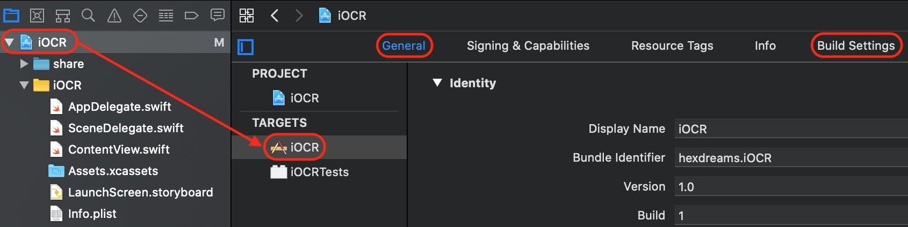
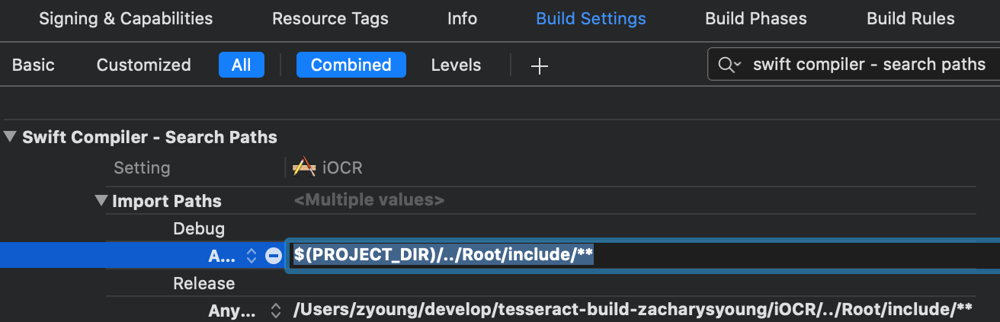
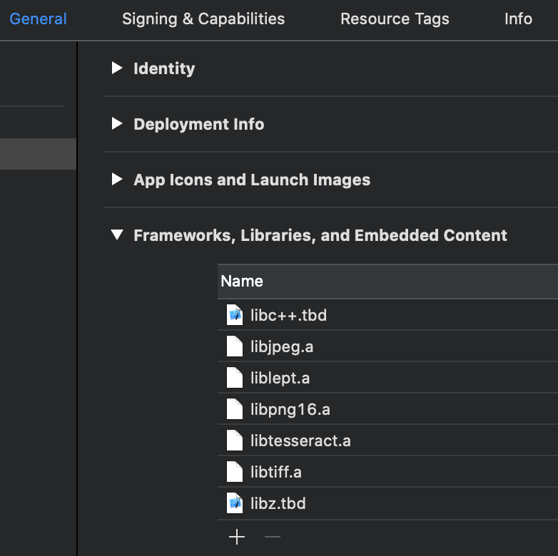
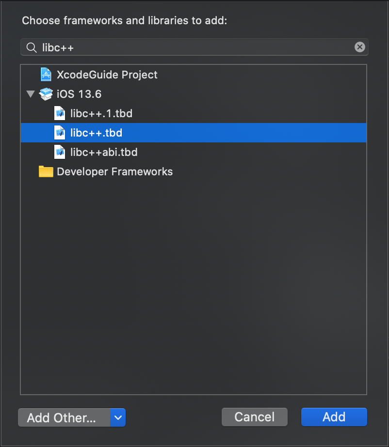
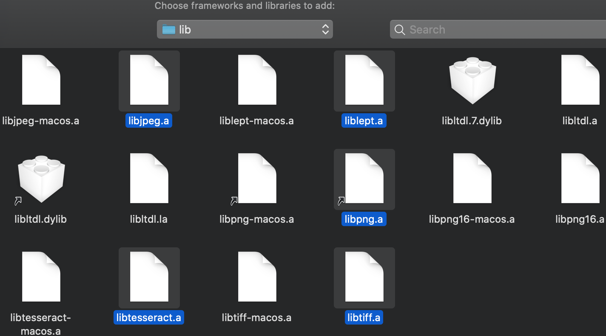
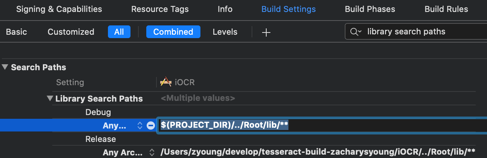
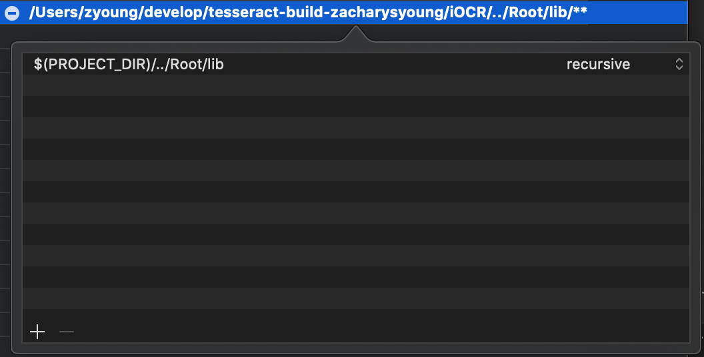
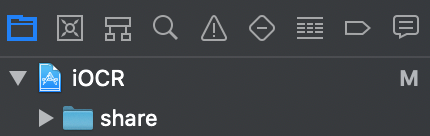

<!-- markdownlint-disable-file MD033 -->
# Configuring Xcode to use a C/C++ API

If you're looking for help to configure Xcode to use the OCR (or any) C/C++ libraries, this might help.

This is written from my perspective of setting up the basic-iOCR project, and shows my progression of working through specific errors.

All references to files and XCode settings can be checked and verified in the iOCR Xcode project.

## The overview

This guide will highlight 4 distinct issues I had to overcome as I was creating my first Xcode project to use the C-APIs for Leptonica and Tesseract.  The first three issues are Xcode-specific build issues, the fourth is a run-time error from one of the unit tests.

For the first three Xcode-issues, all instructions assume you are looking at the project settings:

1. Click on the top-level project in the Project Navigator
1. Select the "main" target:

    

The settings I needed to modify were under the **General** and **Build Settings** tabs.

This overview of the Xcode project will be the basis for the following steps.

## Swift compiler error, **No such module**

```
CompileSwift normal arm64 /Users/zyoung/develop/tesseract-build/iOCR/Shared/RecognizedView.swift (in target 'iOCR (iOS)' from project 'iOCR')
    cd /Users/zyoung/develop/tesseract-build/iOCR
    /Applications/Xcode.app/Contents/Developer/Toolchains/XcodeDefault.xctoolchain/usr/bin/swift -frontend -c -primary-file /Users/zyoung/develop/tesseract-build/iOCR/Shared/RecognizedView.swift
    ...
    ...
/Users/zyoung/develop/tesseract-build/iOCR/Shared/RecognizedView.swift:145:8: error: no such module 'libtesseract'
import libtesseract
```

Swift cannot find my modules **libleptonica** and **libtesseract** which are defined in **Root/include/module.modulemap**.  More to the point, Swift cannot find my modulemap file.

1. Click on **Build Settings**
1. Ensure that **All** and **Combined** are selected
1. Search for **swift compiler - search paths**
1. Expand **Import Paths** and add the following for **Debug** and **Release**, `$(PROJECT_DIR)/../Root/include/**`.  It will expand to the full path:

    

This will add include-options to the **Compile Swift source files** step:

```none
CompileSwift normal arm64 /Users/zyoung/develop/tesseract-build/iOCR/Shared/RecognizedView.swift (in target 'iOCR (iOS)' from project 'iOCR')
    cd /Users/zyoung/develop/tesseract-build/iOCR
    /Applications/Xcode.app/Contents/Developer/Toolchains/XcodeDefault.xctoolchain/usr/bin/swift -frontend -c -primary-file /Users/zyoung/develop/tesseract-build/iOCR/Shared/RecognizedView.swift
    ...
    -I /Users/zyoung/develop/tesseract-build/iOCR/../Root/include -I /Users/zyoung/develop/tesseract-build/iOCR/../Root/include/leptonica -I /Users/zyoung/develop/tesseract-build/iOCR/../Root/include/libltdl -I /Users/zyoung/develop/tesseract-build/iOCR/../Root/include/libpng16 -I /Users/zyoung/develop/tesseract-build/iOCR/../Root/include/tesseract
    ...
```

My modulemap is located in **Root/include**:

```swift
module libtesseract {
    header "tesseract/capi.h"
    export *
}

module libleptonica {
    header "leptonica/allheaders.h"
    export *
}
```

and the paths **tesseract/capi.h** and **leptonica/allheaders.h** are valid from Root/include.

## Xcode error, **Undefined symbols for architecture**

```
Showing All Messages
Ld /Users/zyoung/build/iOCR-fuhsouqsasqfewdpvtdhsyrctgbu/Build/Products/Debug-iphoneos/iOCR.app/iOCR normal (in target 'iOCR (iOS)' from project 'iOCR')
    cd /Users/zyoung/develop/tesseract-build/iOCR
    /Applications/Xcode.app/Contents/Developer/Toolchains/XcodeDefault.xctoolchain/usr/bin/clang -target arm64-apple-ios14.0 -isysroot /Applications/Xcode.app/Contents/Developer/Platforms/iPhoneOS.platform/Developer/SDKs/iPhoneOS14.3.sdk -L/Users/zyoung/build/iOCR-fuhsouqsasqfewdpvtdhsyrctgbu/Build/Products/Debug-iphoneos -F/Users/zyoung/build/iOCR-fuhsouqsasqfewdpvtdhsyrctgbu/Build/Products/Debug-iphoneos -filelist /Users/zyoung/build/iOCR-fuhsouqsasqfewdpvtdhsyrctgbu/Build/Intermediates.noindex/iOCR.build/Debug-iphoneos/iOCR\ \(iOS\).build/Objects-normal/arm64/iOCR.LinkFileList -Xlinker -rpath -Xlinker @executable_path/Frameworks -dead_strip -Xlinker -object_path_lto -Xlinker /Users/zyoung/build/iOCR-fuhsouqsasqfewdpvtdhsyrctgbu/Build/Intermediates.noindex/iOCR.build/Debug-iphoneos/iOCR\ \(iOS\).build/Objects-normal/arm64/iOCR_lto.o -Xlinker -export_dynamic -Xlinker -no_deduplicate -fembed-bitcode-marker -fobjc-link-runtime -L/Applications/Xcode.app/Contents/Developer/Toolchains/XcodeDefault.xctoolchain/usr/lib/swift/iphoneos -L/usr/lib/swift -Xlinker -add_ast_path -Xlinker /Users/zyoung/build/iOCR-fuhsouqsasqfewdpvtdhsyrctgbu/Build/Intermediates.noindex/iOCR.build/Debug-iphoneos/iOCR\ \(iOS\).build/Objects-normal/arm64/iOCR.swiftmodule -Xlinker -no_adhoc_codesign -Xlinker -dependency_info -Xlinker /Users/zyoung/build/iOCR-fuhsouqsasqfewdpvtdhsyrctgbu/Build/Intermediates.noindex/iOCR.build/Debug-iphoneos/iOCR\ \(iOS\).build/Objects-normal/arm64/iOCR_dependency_info.dat -o /Users/zyoung/build/iOCR-fuhsouqsasqfewdpvtdhsyrctgbu/Build/Products/Debug-iphoneos/iOCR.app/iOCR -Xlinker -add_ast_path -Xlinker /Users/zyoung/build/iOCR-fuhsouqsasqfewdpvtdhsyrctgbu/Build/Intermediates.noindex/hexdreamsCocoa.build/Debug-iphoneos/hexdreamsCocoa.build/Objects-normal/arm64/hexdreamsCocoa.swiftmodule

Undefined symbols for architecture arm64:
  "_TessPageIteratorDelete", referenced from:
      $defer #1 () -> () in iOCR.Recognizer.getRecognizedRects() -> [iOCR.RecognizedRectangle] in Recognizer.o
  "_TessPageIteratorBoundingBox", referenced from:
      iOCR.Recognizer.getRecognizedRects() -> [iOCR.RecognizedRectangle] in Recognizer.o
  ...
ld: symbol(s) not found for architecture arm64
clang: error: linker command failed with exit code 1 (use -v to see invocation)
```


-ljpeg-ios -llept-ios -lpng16-ios -ltesseract-ios -ltiff-ios


## Xcode error, Link iOCR **ld: library not found**

```
ld: library not found for -ljpeg-ios
clang: error: linker command failed with exit code 1 (use -v to see invocation)
```

## Xcode error, **Undefined symbol**

Now that the compiler can find the header definitions for the modules, Xcode cannot find the actual symbols to use in the project.

```none
Ld /Users/zyoung/build/iOCR-abqtxibtrzfqvrccvbitswwkxskn/Build/Products/Debug-iphonesimulator/iOCR.app/iOCR normal x86_64 (in target 'iOCR' from project 'iOCR')

...

Undefined symbols for architecture x86_64:
  "_TessPageIteratorDelete", referenced from:
      $defer #1 () -> () in iOCR.Recognizer.getRecognizedRects() -> [iOCR.RecognizedRectangle] in Recognizer.o

...
```

> I am not sure exactly of the distinction between this error (which *appears* to be a linker, "Ld", error) and the next one (which is a legitimate `ld` error).  This error seems to be about Xcode using the symbols for something other than the final build products; Xcode needs to "know about" the libs, but not build upon them?

1. Click on **General**
1. Expand **Frameworks, Libraries, and Embedded Content**
1. Click the **+** button to add the following:

    

    > I've been experiencing this weird behavior in Xcode where I have to follow these steps TWICE for XCode to acutally add the entities.
    >
    > The FIRST time through, the entities are added to the Frameworks folder in the Project Navigator, but not to this list.  The SECOND time through they are added to the list.
    >
    > So, ***you might just need to*** go through the following two steps, and then go through them AGAIN.

    1. For **libc++.tbd** and **libz.tbd**, just search for them by name and click **Add**, like:

        

    1. For the other libs, click **Add Other...** &rarr; **Add Files...**, navigate to **Root/lib**, and select all the libs, **Open**:

        

## Linker error, **Library not found for - ...**

Now that Xcode *knows* about the libraries, it still cannot find them to link in as part of the final binary coming out of the build phase.

```none
ld: library not found for -ltiff
clang: error: linker command failed with exit code 1 (use -v to see invocation)
```

1. Click on **Build Settings**
1. Ensure that **All** and **Combined** are selected
1. Search for **library search paths**
1. Expand **Library Search Paths** and add the following for **Debug** and **Release**, `$(PROJECT_DIR)/../Root/lib/**`

    

    If you happen to double-click the Debug or Release values and see a dialog like this, the **recursive** option is derived from the double-asterisk at the end of the search path (`.../lib/**`):

    

## Add folder reference for tessdata

At this point, the iOCR project is building, that clears up those 3 Xcode-specific errors.

But trying to run `StraightUpRecognitionTest`, I get this run-time error:

```none
Error opening data file ~/$PROJECTDIR/Root/ios_x86_64/share/tessdata/jpn.traineddata
Please make sure the TESSDATA_PREFIX environment variable is set to your "tessdata" directory.
Failed loading language 'jpn'
Tesseract couldn't load any languages!
```

I'm not sure how Xcode decided to look in **Root/ios_x86_64** as all the paths and libraries I've added came from **Root/include** and **Root/lib**, but I'm guessing it's keying-off some build/install data stored in the binary:

```sh
% grep 'Root/ios_x86_64/share/tessdata' Root/lib/libtesseract.a
Binary file Root/lib/libtesseract.a matches
```

Anyways, my solution is to add the **share** directory to the project:

1. Right-click the top-level project in Project Navigator
1. **Add File to "iOCR"...**
1. Navigate to **Root** and select the **share** folder
1. Select **Create folder references**
1. **Add**, and my project looks like:

    

I believe this is required to satisfy this bit of setup code in the test:

```swift
let trainedDataFolder = Bundle.main.path(
    forResource: "tessdata", ofType: nil, inDirectory: "share")
```

and now the test completes with **Test Succeeded**.

## Weird linker error, for test file

In writing this setup guide I ran into an issue where I had copied over some test code, but placed the `import` statements for the OCR modules down in the test file, like this:

```swift
import XCTest
@testable import iOCR

class iOCRTests: XCTestCase {

...

import libleptonica
import libtesseract

class StraightUpRecognitionTest: XCTestCase {

...
```

leading to the **Undefined symbol** error from above.  I cannot reproduce it now (of course), but moving the imports up above the `@testable import` seemed to be what did the trick:

```swift
import XCTest
import libleptonica
import libtesseract
@testable import iOCR

class iOCRTests: XCTestCase {

...

class StraightUpRecognitionTest: XCTestCase {

...
```
