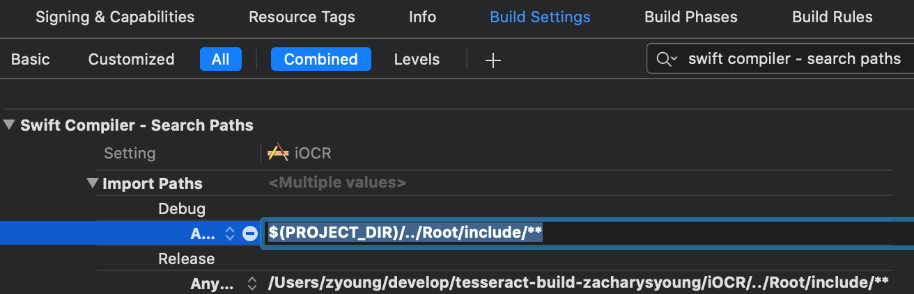
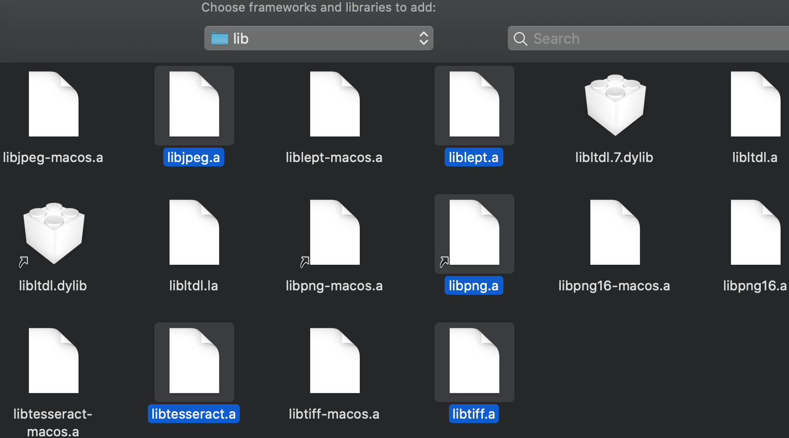

<!-- markdownlint-disable-file MD033 -->
# Configuring Xcode to use a C/C++ API

If you're looking for help to configure Xcode to use a C/C++ API, this might help.

This is written from the ***perspective of the basic iOCR project***, and shows the progression of working through specific errors.

All references to files and XCode settings can be verified/checked/referenced in the iOCR Xcode project file.  The Xcode project has added **include** and **share**

All these settings are found by clicking on your top-level project in the Project Navigator.  From there select your target:


This view of Xcode will be the basis for the following steps.

## Swift Compiler Error, **No such module ...**

Swift cannot find my modules defined in **Root/include/module.modulemap**.

1. Click on **Build Settings**
1. Ensure that **All** and **Combined** are selected
1. Search for **swift compiler - search paths**
1. Expand **Import Paths** and add the following for **Debug** and **Release**, `$(PROJECT_DIR)/../Root/include/**`.  It will expand to the full path.

    

Once Xcode finds the modulemap, the paths in the modulemap need to be correct relative to the modulemap file itself.  My modulemap is located in **Root/include**:

```swift
module libtesseract {
    header "tesseract/capi.h"
    export *
}

module libleptonica {
    header "leptonica/allheaders.h"
    export *
}
```

and the paths **tesseract/capi.h** and **leptonica/allheaders.h** are valid from the include directory.

## Linker error, **Undefined symbol**

Now that the compiler can find the header definitions for the modules, the linker is failing to actually find the defined symbols in the code base:

```none
Ld /Users/zyoung/build/iOCR-abqtxibtrzfqvrccvbitswwkxskn/Build/Products/Debug-iphonesimulator/iOCR.app/iOCR normal x86_64 (in target 'iOCR' from project 'iOCR')

...

Undefined symbols for architecture x86_64:
  "_TessPageIteratorDelete", referenced from:
      $defer #1 () -> () in iOCR.Recognizer.getRecognizedRects() -> [iOCR.RecognizedRectangle] in Recognizer.o

...
```

1. Click on **General**
1. Expand **Frameworks, Libraries, and Embedded Content**
1. Click the **+** button to add the following:

    

    > I've been experiencing this weird behavior in Xcode where I have to follow these steps TWICE for XCode to acutally add the entities.
    >
    > The FIRST time through, the entities are added to the Frameworks folder in the Project Navigator, but not to this project setting.
    >
    > So, just go through the following two steps, and then go through them AGAIN... it's just the Xcode way.

    1. For **libc++.tbd** and **libz.tbd**, just search for them by name and click **Add**, like:
        

    1. For the other libs, click **Add Other...** &rarr; **Add Files...**, navigate to **Root/lib**, and select all the libs:
        

## Linker error, **Library not found for - ...**

The linker cannot locate the libraries:

```none
ld: library not found for -ltiff
clang: error: linker command failed with exit code 1 (use -v to see invocation)
```

1. Add search paths
    1. Add **Library Search Paths** `$(PROJECT_DIR)/../Root/lib/**`


## Weird linker error, for test file

In writing this guide I ran into a real vexing issue where I had copied over some test code, but placed the import for the test down in the file, like this:

```swift
import XCTest
@testable import iOCR

class iOCRTests: XCTestCase {
    ...
}

import libleptonica
import libtesseract

class StraightUpRecognitionTest: XCTestCase {
    func testGuideExample() {

        let uiImage = UIImage(named: "japanese")!
        ...
        var image = pixReadMem(uint8Pointer, data.count)
```

leading to the **Undefined symbol** linker error from above.  I cannot reproduce it now (of course), but moving the imports up above the `@testable import` seemed to help:

```swift
import XCTest
import libleptonica
import libtesseract
@testable import iOCR
```
